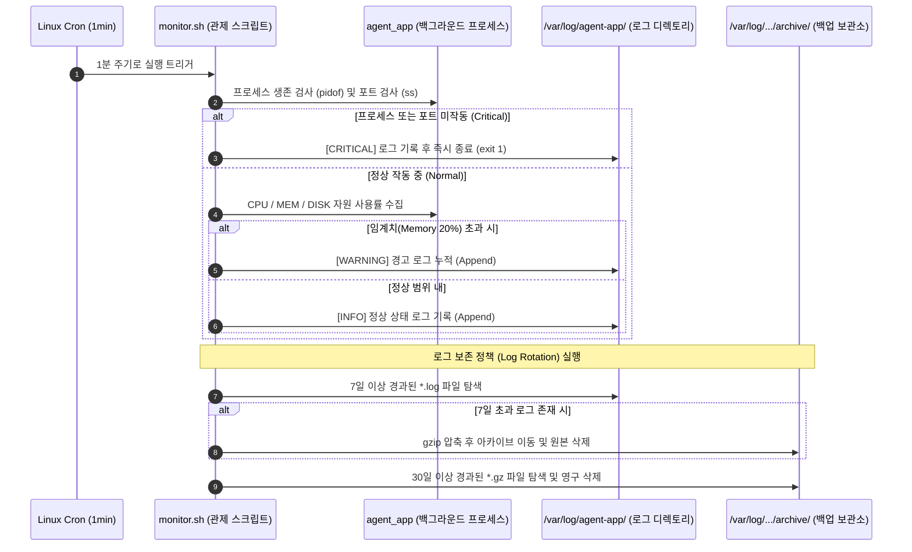

# 🚀 Linux-Based Agent Application Infrastructure & Automation Project

본 프로젝트는 **Ubuntu 22.04 LTS** 환경에서 리눅스 시스템 보안 및 프로세스 자동 관제 인프라를 성공적으로 구축한 엔지니어링 미션입니다. **최소 권한 원칙(Principle of Least Privilege)**을 준수하여 다중 사용자 격리 보안 체계를 설계하였으며, 백그라운드 에이전트 서비스(`agent_app`)의 안정적인 구동과 무중단 관제를 위한 실시간 모니터링 자동화 스크립트(`monitor.sh`), 그리고 디스크 고갈 방지를 위한 시간 기반 로그 관리(Log Rotation) 정책을 수립하였습니다.

---

## 📌 프로젝트 개요 및 수행 프로세스

이 프로젝트는 시스템 인프라 설계부터 네트워크 보안, 백그라운드 프로세스 관제, 그리고 자동화된 로그 수명 주기 관리(Rotation)까지 전 과정을 체계적으로 구현하였습니다.

### ⚙️ 시스템 아키텍처 & 데이터 흐름
아래 다이어그램은 백그라운드에서 실행되는 `agent_app`과 크론탭(Crontab)을 통해 1분 주기마다 실행되는 `monitor.sh` 관제 스크립트의 유기적인 상호작용 및 로그 처리 흐름을 보여줍니다.



### 🗓️ 단계별 프로젝트 수행 방식
1. **1단계: 인프라 격리 및 최소 권한 설계**
   * 프로젝트 요구사항에 맞추어 관리자(`agent-admin`), 개발자(`agent-dev`), 테스트 계정(`agent-test`)과 핵심 협업 그룹(`agent-core`, `agent-common`)을 구성하였습니다.
   * 주요 디렉토리 및 보안 파일(`secret.key`)에 리눅스 권한 설정을 적용하여 무단 접근 및 보안 위협을 원천 차단하였습니다.
2. **2단계: 보안 강화 및 네트워크 접근 통제**
   * SSH 포트 변경(22 -> 20022) 및 Root 외부 접속 차단을 통해 보안을 강화하고 무차별 대입 공격 위협을 낮췄습니다.
   * 방화벽(UFW) 정책을 기본 차단(Deny)으로 수립하고, SSH(20022) 및 앱 포트(15034)만을 명시적으로 허용(Allow)하는 화이트리스트 접근 제어를 수행했습니다.
3. **3단계: 백그라운드 구동 및 실시간 관제 자동화**
   * 에이전트 앱의 실행 환경 변수 설정을 계정 프로필에 주입하여 항상 고정된 환경에서 구동(Boot Sequence)되도록 유도하였습니다.
   * `monitor.sh` Bash 스크립트를 작성하여 시스템 자원 감시 및 7일/30일 단위의 디스크 로그 보존 정책(Log Rotation)을 자동 실행하도록 크론탭에 등록하였습니다.

---

## 🏗️ 1. 인프라 구조 및 권한 설계 (Evaluation 1, 2, 3)

### 📁 디렉토리 계층 구조 및 권한 매칭 현황
최소 권한 원칙을 엄격하게 적용하여 각 디렉토리 및 파일의 소유자와 그룹 권한을 세분화하여 설정하였습니다.

| 절대 경로 | 소유자 (Owner) | 그룹 (Group) | 권한 (Perm) | 권한 설정 명령어 및 엔지니어링 의미 |
| :--- | :--- | :--- | :--- | :--- |
| `/home/agent-admin/agent-app/` | `agent-admin` | `agent-core` | `755` | `sudo chmod 755 [경로]`<br>외부 계정의 디렉토리 진입(`x`) 및 목록 조회(`r`)를 허용하되, 쓰기는 차단 |
| `├── agent_app` | `agent-admin` | `agent-core` | `755` | `sudo chmod 755 [파일]`<br>에이전트 유닉스 바이너리 실행 권한을 관리자 및 외부 계정에게 부여 |
| `├── api_keys/secret.key` | `agent-admin` | `agent-core` | `600` | `sudo chmod 600 [파일]`<br>**보안 디렉토리 내 중요 키**. 소유자 외 다른 사용자의 읽기/쓰기를 완벽히 차단 |
| `└── bin/monitor.sh` | `agent-dev` | `agent-core` | `750` | `sudo chmod 750 [파일]`<br>**개발자 소유, 어드민 그룹 실행**. 제3자 외부 계정의 접근 및 실행 시도를 원천 차단 |
| `└── upload_files/` | `agent-admin` | `agent-common` | `770` | `sudo chmod 770 [경로]`<br>**공유 디렉토리**. 동일 그룹(`agent-common`) 내 사용자들 간에 자유로운 R/W 협업 보장 |
| `/var/log/agent-app/` | `agent-admin` | `agent-core` | `770` | `sudo chmod 770 [경로]`<br>실시간 모니터링 로그 저장소로, 핵심 관리자 그룹 외에는 열람 및 임의 수정을 차단 |
| `/var/log/monitor/agent-app/archive/` | `agent-admin` | `agent-core` | `775` | `sudo chmod 775 [경로]`<br>[보너스 2] 로그 보존 정책에 의해 압축 백업본(`.gz`)이 보관되는 아카이브 전용 공간 |

### 👥 계정 및 그룹 구성 현황
* **`agent-admin`**: 인프라 운영/관리 및 자동 관제 스크립트 실행 주체 (`agent-common`, `agent-core` 소속)
* **`agent-dev`**: 애플리케이션 개발자이자 관제 스크립트(`monitor.sh`) 작성 및 디버거 (`agent-common`, `agent-core` 소속)
* **`agent-test`**: QA 및 기능 테스트를 수행하는 계정 (`agent-common` 소속, 핵심 보안 자산 접근 불가)

---

## 🛡️ 2. 핵심 보안 및 네트워크 설정 (Evaluation 1, 3)

### 1) SSH 포트 변경 및 Root 원격 접속 차단
* **설정 파일**: `/etc/ssh/sshd_config`
* **설정 명령어**:
  ```bash
  sudo sed -i 's/#Port 22/Port 20022/' /etc/ssh/sshd_config
  sudo sed -i 's/#PermitRootLogin prohibit-password/PermitRootLogin no/' /etc/ssh/sshd_config
  sudo systemctl restart sshd
  ```

### 2) 방화벽(UFW) 최소 개방 정책
인바운드 트래픽을 타이트하게 제어하여 인프라의 공격 표면(Attack Surface)을 최소화하였습니다.
* **설정 명령어**:
  ```bash
  sudo ufw default deny inbound
  sudo ufw allow 20022/tcp  # 신규 SSH 포트 허용
  sudo ufw allow 15034/tcp  # APP 서비스 포트 허용
  sudo ufw enable
  ```

---

## 🚀 3. 애플리케이션 구동 및 자동 관제 구현 (Evaluation 1, 2, 3)

### 1) 에이전트 서비스 환경 변수 및 Boot Sequence 완수
`agent-admin` 계정의 `~/.bashrc` 파일 하단에 애플리케이션 동작에 필수적인 시스템 환경 변수를 고정적으로 등록하여 실행 환경을 보장합니다.
* **배포 및 백그라운드 기동 명령어**:
  ```bash
  # agent-admin 계정 세션으로 진입 후 실행
  cd /home/agent-admin/agent-app
  nohup ./agent_app > /var/log/agent-app/app_init.log 2>&1 &
  ```

### 2) 시스템 관제 자동화 스크립트 (monitor.sh)
* **파일 위치**: `/home/agent-admin/agent-app/bin/monitor.sh`
* **동작 주기 설정** (`crontab -e` 등록):
  ```cron
  * * * * * /home/agent-admin/agent-app/bin/monitor.sh
  ```

### 3) [보너스 2] 시간 기반 로그 보존 정책 (Log Rotation)
서버 디스크 공간 고갈 장애를 방지하기 위해 예외 처리가 가미된 로그 아카이브 및 제거 로직을 `monitor.sh` 내에 구현하였습니다.
* **7일 경과**: `/var/log/agent-app/` 내의 `.log` 파일들을 탐색하여 `gzip` 압축 후 아카이브 디렉토리로 이동시키고, 원본 로그 파일은 안전하게 삭제(`rm -f`)합니다.
* **30일 경과**: 아카이브 디렉토리 내에 보관 중인 `.gz` 압축 로그를 추적하여 디스크에서 영구 삭제합니다.
* **예외 처리 방어 코드**:
  - 아카이브 디렉토리가 미존재할 경우 자동 생성(`mkdir -p`).
  - 스크립트 구동 권한이 부족하여 로그 쓰기/삭제가 불가능할 시 `[CRITICAL]` 로그를 즉시 생성한 후 비정상 종료 코드(`exit 1`) 반환.
  - 처리할 대상 로그 파일이 없을 경우(`0`개) 에러 발생 없이 스킵(`Skipped`) 처리.

---

## 🔍 인프라 설정 및 구동 검증 가이드 (Verification Guide)

인프라 아키텍처가 적절하고 견고하게 구축되었는지 검증하고 상태를 점검할 수 있도록 필요한 터미널 명령어를 목적별로 분리하여 제공합니다.

### 👥 1. 사용자 및 그룹 권한 검증
리눅스 서버 상에서 최소 권한 정책에 맞추어 계정과 그룹이 생성 및 할당되었는지 확인합니다.

```bash
# 1. 각 사용자 계정의 UID, GID 및 소속 그룹 정보 일괄 검증
id agent-admin
id agent-dev
id agent-test

# 2. 관련 그룹(agent-core, agent-common) 생성 여부 및 멤버 리스트 팩트 체크
grep -E "agent-core|agent-common" /etc/group
```
* **기대 결과**:
  - `agent-admin` & `agent-dev` 계정은 `agent-core` 및 `agent-common` 두 그룹에 모두 소속되어 있어야 합니다.
  - `agent-test` 계정은 `agent-common` 그룹에만 소속되어 있고, `agent-core` 그룹에는 속하지 않아야 합니다.

---

### 📁 2. 디렉토리 및 파일 접근 권한 검증
비인가된 사용자로부터 보안 파일 및 로그를 격리하기 위해 설정된 파일시스템 권한을 검증합니다.

```bash
# 1. 최상위 에이전트 앱 폴더의 권한(755) 확인
ls -ld /home/agent-admin/agent-app/

# 2. 중요 키 파일(secret.key) 소유자 독점 권한(600) 확인
ls -l /home/agent-admin/agent-app/api_keys/secret.key

# 3. 개발자의 스크립트 실행 권한 및 일반 접근 차단(750) 확인
ls -l /home/agent-admin/agent-app/bin/monitor.sh

# 4. 공유 업로드 폴더 및 로그 폴더의 그룹 협업 권한(770) 확인
ls -ld /home/agent-admin/agent-app/upload_files/
ls -ld /var/log/agent-app/
```
* **기대 결과**:
  - `secret.key` 권한은 `-rw-------` 이어야 하며, `monitor.sh` 권한은 `-rwxr-x---` 이어야 합니다.
  - `upload_files`와 `/var/log/agent-app` 디렉토리 권한은 `drwxrwxr--` 또는 `drwxrwx---` 형태여야 외부 일반 계정의 쓰기/읽기 접근을 방어할 수 있습니다.

---

### 🛡️ 3. 네트워크 및 방화벽 설정 검증
포트 변경 사항이 적용되었는지와 화이트리스트 기반의 트래픽 필터링이 가동 중인지 팩트 체크합니다.

```bash
# 1. SSH 포트가 20022번으로 설정 파일에 정상 반영되었는지 체크
grep -E "^Port|^PermitRootLogin" /etc/ssh/sshd_config

# 2. 20022 포트가 커널 소켓 수준에서 정상 Listen 상태인지 확인
ss -tulnp | grep sshd

# 3. UFW 방화벽이 활성화(active) 상태이며 지정된 화이트리스트 외 차단 중인지 확인
sudo ufw status verbose
```
* **기대 결과**:
  - `Port 20022` 및 `PermitRootLogin no` 설정이 반환됩니다.
  - `ufw status` 결과로 `20022/tcp` 및 `15034/tcp`가 `ALLOW IN` 상태여야 하며, Default Action은 `deny (incoming)`이어야 합니다.

---

### ⚙️ 4. 백그라운드 프로세스 및 자동 관제 검증
에이전트 서비스가 정상 구동되었는지와 1분 주기 모니터링이 자동 수집되고 있는지 확인합니다.

```bash
# 1. 백그라운드에서 agent_app 프로세스가 실시간 동작 중인지 조회
ps -ef | grep agent_app | grep -v grep

# 2. 에이전트 서비스 전용 포트(15034) 리스닝 상태 체크
ss -tulnp | grep 15034

# 3. 크론탭에 monitor.sh 스크립트가 누락 없이 등록되었는지 확인
sudo crontab -u agent-admin -l

# 4. 1분 주기로 관제 로그가 정상 수집되어 누적되고 있는지 실시간 모니터링
tail -f /var/log/agent-app/monitor.log
```
* **기대 결과**:
  - `agent_app` 프로세스의 PID와 실행 경로가 확인되어야 합니다.
  - `tail -f` 구동 시 매 1분 정각 근처마다 `[INFO]` 혹은 `[WARNING]` 형태로 CPU/MEM/DISK 통계 데이터가 한 줄씩 자동 누적되어 화면에 찍힙니다.

---

## 🕵️‍♂️ 4. 평가 문항 핵심 지표 증적 자료 (Artifacts)

### 🟢 증적 1: 에이전트 앱 Boot Sequence 5단계 전원 [OK] 통과
애플리케이션 가동 시 표준 출력으로 기록되는 자가 진단 및 초기화 부트 로그 데이터입니다.
```text
>>> Starting Agent Boot Sequence...
[1/5] Checking User Account               [OK]
   ... Running as service user 'agent-admin' (uid=1001)
[2/5] Verifying Environment Variables     [OK]
   ... All required Envs correct
[3/5] Checking Required Files             [OK]
   ... Verified 'secret.key' with correct key string.
[4/5] Checking Port Availability          [OK]
   ... Port 15034 is available.
[5/5] Verifying Log Permission            [OK]
   ... Log directory is writable: /var/log/agent-app
------------------------------------------------------------
All Boot Checks Passed!
Agent READY
```

### 🟢 증적 2: 관제 스크립트에 의한 실시간 수집 및 보존 로그 (monitor.log)
`monitor.sh`에 의해 매분 수집되는 원천 데이터입니다. 애플리케이션 임계치(예: MEM > 20%) 초과 시 WARNING 메시지가 함께 기록됩니다.
```text
[2026-05-30 15:30:01] PID:25287 CPU:5% MEM:31% DISK_USED:9%
[2026-05-30 15:30:01] [WARNING] MEM threshold exceeded! (Current: 31%)
[2026-05-30 15:30:01] [INFO] No logs older than 7 days found. Compression skipped.
[2026-05-30 15:31:01] PID:25287 CPU:12% MEM:36% DISK_USED:9%
[2026-05-30 15:31:01] [WARNING] MEM threshold exceeded! (Current: 36%)
[2026-05-30 15:31:01] [INFO] No logs older than 7 days found. Compression skipped.
```

---

## 🧠 5. 엔지니어링 인터뷰 및 이론적 근거 (Evaluation 2, 3, 4)

각 인프라 설정에 따른 보안적 가치와 시스템 설계 의도에 대한 기술적 질의응답 정리입니다.

<details>
<summary>💡 Q1. SSH 포트 변경 및 Root 접속 차단이 왜 위협 모델 관점에서 효과적인가?</summary>
<div markdown="1">

**답변**:  
인터넷에 노출된 서버는 무차별 대입 공격(Brute Force Attack)과 자동화된 스캐닝 봇의 상시적인 표적이 됩니다. 봇들은 기본 포트인 22번을 타격하고 최고 권한자인 root 계정 탈취를 시도합니다.  
포트를 20022로 바꾸는 것만으로도 단순 스캐닝 타격 대상에서 99% 제외(**Security through obscurity**)되며, `PermitRootLogin no` 설정을 통해 외부 가상 단말을 통한 최고 권한으로의 다이렉트 진입 경로를 원천 차단할 수 있습니다. 설령 하위 계정의 패스워드가 노출되더라도 공격자가 바로 root로 침입할 수 없기 때문에 2차 침투 단계를 요구하게 만듭니다.

</div>
</details>

<details>
<summary>💡 Q2. api_keys와 로그 디렉토리를 agent-core 그룹으로 제한한 이유는 무엇인가?</summary>
<div markdown="1">

**답변**:  
최소 권한 원칙(Principle of Least Privilege)에 따른 전형적인 파일시스템 권한 장벽 설계입니다.  
테스트 계정(`agent-test`)이나 일반 외부 프로세스는 서비스의 핵심 인증 자산인 `secret.key`를 읽을 권한이 전혀 필요하지 않습니다. 또한 시스템 내부 관제 로그를 임의로 수정하거나 삭제할 권한이 주어질 경우 침입 후 흔적 지우기 등의 보안 사고가 우려됩니다. 따라서 핵심 인프라 및 소스 제어 권한을 쥔 `agent-admin`과 `agent-dev`만 `agent-core` 그룹으로 묶어 해당 영역의 R/W 권한을 독점케 함으로써 내부 위협 및 수평적 권한 상승 공격을 차단합니다.

</div>
</details>

<details>
<summary>💡 Q3. 관제 스크립트 내부에서 사용한 핵심 명령어(pidof, ss)의 선택 이유는 무엇인가?</summary>
<div markdown="1">

**답변**:  
* **프로세스 식별 (`pidof`)**: `pgrep -f`는 인자로 스크립트 경로에 포함된 문자열(`monitor.sh` 등)까지 파싱하여 오탐지할 우려가 큽니다. 반면 `pidof`는 Linux 커널 순수 매칭을 수행해 정확히 해당 바이너리 명칭(`agent_app`)을 명시적으로 갖는 PID만 정밀 검출하므로 백그라운드 관제에 가장 적합하고 오작동이 없습니다.
* **포트 확인 (`ss -tuln`)**: 기존 `netstat`은 커널 `/proc/net`을 문자열 기반으로 비효율적으로 파싱하므로 무겁고 속도가 느립니다. 이에 따라 최신 Linux 배포판에서 기본적으로 Deprecated 처리되었습니다. 반면 `ss` 명령어는 커널의 넷링크(Netlink) 인터페이스를 사용하여 소켓 상태를 메모리 단에서 직접 긁어오므로 정보 수집 속도가 매우 빠르고 성능 부하를 크게 낮출 수 있습니다.

</div>
</details>

<details>
<summary>💡 Q4. CPU/MEM/DISK 자원 추출 방식과 리다이렉션 기호(>, >>)의 차이는?</summary>
<div markdown="1">

**답변**:  
* **자원 파싱 기법**:  
  - **CPU**: `top -bn1`을 사용해 CPU Idle 값을 구한 뒤, `100 - idle` 수식을 통해 전체 코어의 순간 사용률을 백분율로 연산하였습니다.  
  - **MEM**: `free` 명령어의 전체 용량 대비 사용량 비율을 `awk`로 소수점 파싱하여 가공하였습니다.  
  - **DISK**: Root 파일시스템(`/`)을 대상으로 `df /` 결과의 5번째 필드(사용률)를 파싱했습니다.
* **리다이렉션 차이**:  
  - `>` 기호는 파일이 이미 존재하면 그 내용을 완전히 비우고 새로운 스트림을 기재하는 **덮어쓰기(Overwrite)** 모드입니다.  
  - `>>` 기호는 기존 파일 내용의 끝부분부터 데이터를 연이어 덧붙이는 **추가(Append)** 모드입니다.  
  장애 시점의 모니터링 원인 분석을 위해 누적 히스토리가 절대적으로 필요한 로그 관제 시스템 설계에는 데이터 유실을 방지하기 위해 무조건 `>>` (Append)를 선택해야 합니다.

</div>
</details>

<details>
<summary>💡 Q5. "경고는 출력하되 종료하지 않는 항목"을 분리한 운영상의 이유는 무엇인가?</summary>
<div markdown="1">

**답변**:  
에이전트 서비스의 중단 여부를 결정짓는 핵심 지표(프로세스 다운, 서비스 포트 미개방)는 시스템 생존 자체와 직결되는 **치명적인 결함(Critical Failure)**입니다. 이 경우 즉시 스크립트를 `exit 1`로 종료해 관리 시스템이나 크론 스케줄러에 에러 플래그를 올려 긴급 조치를 취해야 합니다.  
반면, 방화벽 비활성화나 단순 리소스 임계치 초과(예: MEM > 20%)는 현재 서비스 자체는 중단 없이 정상 구동 중인 상태입니다. 만약 이를 치명적 오류로 보아 모니터링 스크립트를 즉각 중단(`exit 1`) 시켜버린다면, 이후의 후속 관제 및 리소스 상태 모니터링 주기 전체가 마비되는 결과를 초래합니다. 따라서 이러한 현상은 `[WARNING]` 로그 형태로 기록하고 모니터링 실행 흐름을 지속적으로 이어가는 것이 올바른 시스템 설계 방향입니다.

</div>
</details>

<details>
<summary>💡 Q6. 모니터링 대상이 웹 서버(Nginx)로 바뀐다면 변경해야 할 포인트는?</summary>
<div markdown="1">

**답변**:  
1. **프로세스 명**: `agent_app`에서 `nginx` 마스터 프로세스 및 워커 프로세스 추적으로 변경.
2. **서비스 포트**: TCP `15034`에서 웹 기본 표준 포트인 TCP `80` (HTTP) 또는 `443` (HTTPS) 청취 상태 확인으로 변경.
3. **임계값 및 메트릭 확장**: 웹 서버는 트래픽 폭증이 빈번하므로 기본 CPU/MEM 경고 임계값을 상향 조정(예: CPU > 70%)하고, 단순히 시스템 리소스 외에 Nginx 커넥션 상태(`Active Connections`)를 감시하기 위한 stub_status 모니터링 로직을 스크립트에 통합해야 합니다.

</div>
</details>

<details>
<summary>💡 Q7. "프로세스는 살아있는데 포트가 안 열리는 상황" 발생 시 원인 후보와 확인 순서는?</summary>
<div markdown="1">

**답변**:  
* **원인 후보**:  
  1. 애플리케이션 내부 소켓 바인딩(Socket Binding) 코드의 데드락(Deadlock) 또는 초기화 단계 내 무한 루프.  
  2. 네트워크 인터페이스 바인딩 오류 (예: 외부 요청을 받아야 하나 로컬 호스트 `127.0.0.1` 루프백으로 바인딩되어 외부 리스닝 포트로 탐지가 불가능한 상태).  
  3. 동일한 포트를 다른 유령 프로세스가 먼저 선점하여 바인딩에 실패(Address already in use)하였음에도 프로세스가 예외 처리 없이 백그라운드에 상주하는 경우.
* **확인 순서**:  
  1. `ss -tulnp | grep [포트]` 명령어를 통해 해당 포트를 쥐고 있는 다른 프로세스가 존재하는지 먼저 파악합니다.  
  2. 앱의 초기 부팅 로그(`cat /var/log/agent-app/app_init.log`)를 확인하여 `bind: address already in use` 또는 포트 할당 관련 에러 메시지가 존재하는지 분석합니다.  
  3. `strace -p [PID]` 명령어를 가동하여 현재 살아있는 프로세스가 어떤 시스템 콜(System Call, 예: `accept`, `select`) 단계에서 Block되어 멈춰 있는지 정밀 추적합니다.

</div>
</details>

<details>
<summary>💡 Q8. 로그 급증으로 디스크 고갈 위기 시 운영자가 취할 즉각적인 대응책은?</summary>
<div markdown="1">

**답변**:  
* **단기 대응 (긴급 조치)**:  
  1. `sudo tail -n 100` 등을 통해 비정상적인 디버그 로그 폭증이 일어나는 특정 파일 경로를 진단합니다.  
  2. **가장 중요**: 용량이 거대한 로그 파일에 대고 `cp /dev/null /var/log/.../monitor.log` 명령을 내려 서비스의 파일 쓰기 동작을 깨뜨리지 않고 디스크 용량을 0으로 안전하게 비워냅니다. (가동 중인 파일에 대고 `rm` 명령을 내리면 프로세스가 파일 디스크립터를 계속 쥐고 있어 디스크 용량이 반환되지 않는 디스크 누수 현상이 발생합니다)  
  3. 보관 중인 옛날 아카이브 압축 로그 파일(`.gz`) 중 우선순위가 낮은 파일들을 삭제하거나 원격 오브젝트 스토리지로 소거합니다.
* **장기 대응 (아키텍처 개선)**:  
  1. 본 프로젝트에서 구현한 로그 보존 정책(`Log Rotation`)을 시스템 레벨에 확실하게 안착시키고, 일별 로그 용량을 타이트하게 로테이션시키는 `logrotate` 데몬 설정을 시스템 공식 규칙으로 등록합니다.  
  2. 장기적으로는 서버 로컬 디스크에 영구적으로 로그를 보관하는 방식에서 벗어나, `Fluentd`, `Logstash` 같은 수집 전송 도구를 에이전트마다 배포하여 중앙 집중형 로그 서비스(Elasticsearch, Splunk, 클라우드 클러스터)로 로그를 실시간 포워딩하도록 아키텍처를 고도화해야 합니다.

</div>
</details>