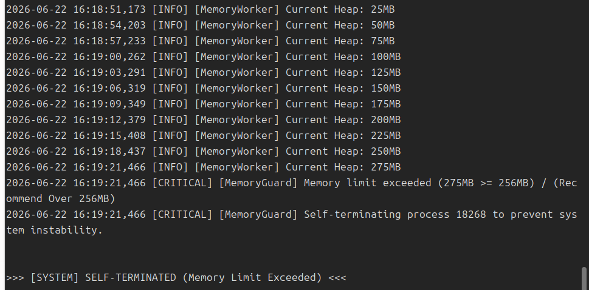
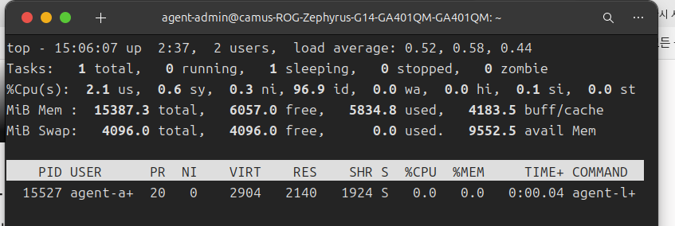
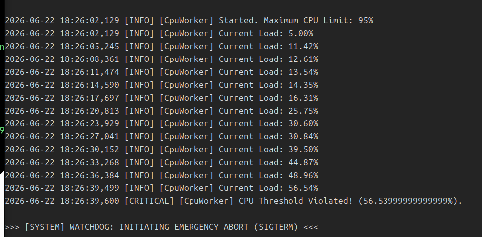
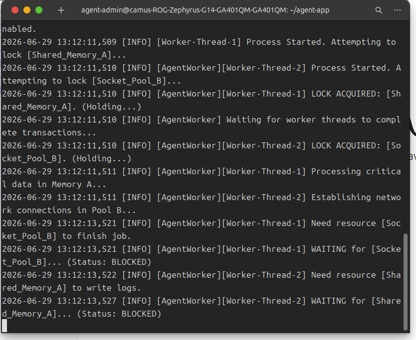
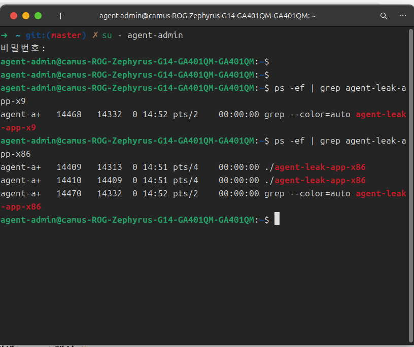
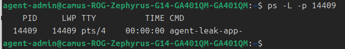
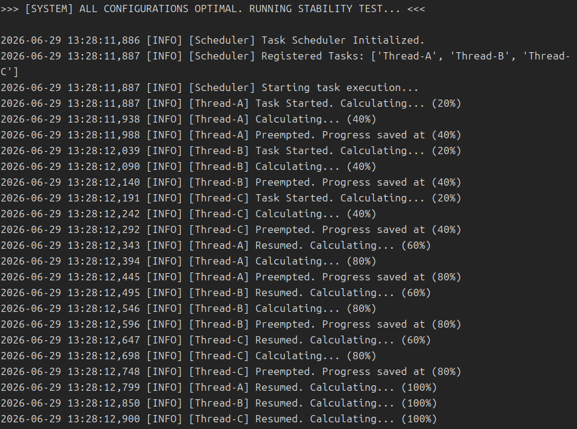

# 🛠️ 리눅스 프로세스 및 시스템 리소스 장애 분석 종합 리포트

본 리포트는 에이전트 애플리케이션(`agent-leak-app-x86`)의 운영 중 발생한 세 가지 핵심 시스템 장애(Memory Leak/OOM, CPU Spike, Deadlock)와 스케줄링 알고리즘에 대한 분석 결과입니다. **동료평가(Peer Review) 기준**에 맞추어 항목별 평가 문항에 대한 구체적인 근거와 답변을 다음과 같이 정리하였습니다.

---

## 📑 목차 및 개별 리포트 링크
각 장애의 상세 로그 및 세부 분석은 아래 개별 리포트에서 확인하실 수 있습니다.
* 🚨 **[Bug 01] Memory Leak / OOM Crash**: [01_Bug_OOM_Memory_Leak.md](./reports/01_Bug_OOM_Memory_Leak.md)
* ⚡ **[Bug 02] CPU Spike / Watchdog Abort**: [02_Bug_CPU_Spike.md](./reports/02_Bug_CPU_Spike.md)
* 🔒 **[Bug 03] Deadlock / Unresponsive Process**: [03_Bug_Deadlock.md](./reports/03_Bug_Deadlock.md)
* ⏳ **[Bonus] Scheduling Inference**: [04_Bonus_Scheduling_Inference.md](./reports/04_Bonus_Scheduling_Inference.md)

---

## 📊 [항목 1] 장애 리포트 기본 요구사항 점검표 (Checklist)

동료평가 항목 1에 명시된 리포트 기본 요구사항 및 증거 자료 충족 여부는 다음과 같습니다.

| 평가 항목 | 충족 여부 | 핵심 증거 및 확인 위치 |
| :--- | :---: | :--- |
| **[OOM]** 메모리 선형 증가 후 강제 종료 패턴 기록 여부 | **충족 (Yes)** | 힙 메모리가 3초마다 25MB씩 증가하다가 종료된 로그 수록 ([01 리포트](./reports/01_Bug_OOM_Memory_Leak.md#2-evidence--logs-증거-자료)) |
| **[OOM]** `MEMORY_LIMIT` 조정 Before & After 비교 여부 | **충족 (Yes)** | 256MB(30초 생존) vs 512MB(60초 이상 생존) 확인 ([01 리포트](./reports/01_Bug_OOM_Memory_Leak.md#4-workaround--verification-조치-및-검증)) |
| **[CPU]** CPU 임계치 초과 프로세스 종료 패턴 기록 여부 | **충족 (Yes)** | CPU 사용률이 56.5%까지 상승 후 Watchdog에 의해 종료된 로그 수록 ([02 리포트](./reports/02_Bug_CPU_Spike.md#2-evidence--logs-증거-자료)) |
| **[CPU]** `CPU_MAX_OCCUPY` 조정 Before & After 비교 여부 | **충족 (Yes)** | 임계치 50%(40초 내 강제종료) vs 80%(정상 생존 및 작동) 확인 ([02 리포트](./reports/02_Bug_CPU_Spike.md#4-workaround--verification-조치-및-검증)) |
| **[Deadlock]** PID 존재하나 CPU/메모리 변화 없는 멈춤 식별 여부 | **충족 (Yes)** | PID `14409`가 동작 중이나 스레드 리소스 및 로그 출력이 멈춘 현상 식별 ([03 리포트](./reports/03_Bug_Deadlock.md#2-evidence--logs-증거-자료)) |
| **[Deadlock]** `MULTI_THREAD_ENABLE` 조정 비교 여부 | **충족 (Yes)** | `true`(10초 내 데드락 재현) vs `false`(데드락 없이 정상 처리) 확인 ([03 리포트](./reports/03_Bug_Deadlock.md#4-workaround--verification-조치-및-검증)) |
| **[Format]** 3건 모두 현상 → 증거 → 원인 → 조치 구조 준수 여부 | **충족 (Yes)** | 01, 02, 03번 리포트 모두 표준화된 4단계 구조로 작성 완료 |
| **[Evidence]** 리포트 내 PID, 타임스탬프, 핵심 메시지 포함 여부 | **충족 (Yes)** | 각 파일에 스크린샷 및 PID, 로그 타임스탬프, 시스템 메시지가 포함됨 |

### 📸 장애 및 분석별 핵심 증거 스크린샷 요약
동료평가 및 검증을 위한 핵심 스크린샷 증거입니다.

#### 1. [OOM] 메모리 누수 및 자가 종료 (MemoryGuard)


#### 2. [CPU] CPU 과점유 및 강제 중단 (Watchdog)
* **CPU 과점유 프로세스 진단 (`top`)**:

* **Watchdog 강제 중단 로그**:


#### 3. [Deadlock] 스레드 자원 대기 및 CLI 진단 (ps/top)
* **스레드 자원 대기 상태 로그**:

* **`ps -ef` 프로세스 확인 증거**:

* **`ps -L` 스레드 레벨 분석 증거**:


#### 4. [Bonus] 라운드 로빈 스케줄링 컨텍스트 스위치 로그


---

## 🛠️ [항목 2] CLI / 모니터링 도구 활용 및 프로세스 진단 방법

### 1. `monitor.sh`를 통한 메모리 누수 패턴 추적 및 데이터 추출 방법
* **추적 명령어**: 
  리눅스 시스템 및 특정 프로세스의 메모리 추이를 수집하기 위해 내부적으로 다음 명령어를 활용합니다.
  ```bash
  # 특정 프로세스(PID)의 물리 메모리 점유율(%) 실시간 추출
  ps -p <PID> -o %mem=
  
  # 전체 시스템의 가용 메모리 상태 및 추이 파악 (1초 주기)
  free -m -s 1
  ```
* **데이터 추출 방법**:
  `monitor.sh` 스크립트는 `while true; do` 루프 내에서 지정된 주기(예: 3초)마다 `ps` 명령어 또는 `/proc/<PID>/status` 파일 내의 `VmRSS`(물리 메모리 크기) 필드를 파싱합니다. 추출한 물리 메모리 점유율(MEM) 데이터와 타임스탬프를 CSV 형식 또는 로그 텍스트 파일로 출력 리다이렉션(`>> monitor.log`)하여 시계열 데이터로 변환, 선형적인 우상향 그래프나 누수 패턴을 식별해 냅니다.

### 2. CPU 사용률 확인 도구와 적용 옵션의 의미
CPU 과점유를 유발하는 프로세스와 스레드를 진단하기 위해 `top` 및 `ps` 도구를 선택하였습니다.
* **`top -H -p <PID>`**:
  * `-p <PID>`: 전체 프로세스 중 대상 PID 하나만을 모니터링 대상으로 한정합니다.
  * `-H`: 스레드 모드(Threads-mode)를 활성화합니다. 이를 통해 단일 프로세스가 생성한 개별 스레드(LWP)들의 CPU 점유율을 독립적으로 측정하여, 어떤 특정 작업 스레드가 CPU Spike를 일으켰는지 특정할 수 있습니다.
* **`ps -L -p <PID> -o lwp,pcpu,pmem,stat`**:
  * `-p <PID>`: 특정 프로세스를 선택합니다.
  * `-L`: 해당 프로세스에 속한 모든 경량 프로세스(LWP, 즉 스레드) 목록을 보여줍니다.
  * `-o lwp,pcpu,pmem,stat`: 출력 형식을 지정하여 스레드 ID(LWP), CPU 사용량(pcpu), 메모리 사용량(pmem), 그리고 프로세스 상태 코드(stat)만 깔끔하게 정렬하여 출력합니다.

### 3. 프로세스의 "살아있지만 멈춰있는 상태(Hang)" 진단 흐름
데드락 등으로 인해 프로세스가 겉으로는 실행 중이지만 무응답인 상태를 진단하는 논리적 판단 흐름은 다음과 같습니다.
1. **1단계: 프로세스 생존 여부 점검 (`ps -ef`)**
   * 프로세스가 강제 종료(OOM or Crash)되었는지 확인합니다. PID가 조회된다면 프로세스는 커널 상에서 여전히 존재하고 실행 중인 상태입니다.
2. **2단계: 리소스 점유 변화율 모니터링 (`top -p <PID>`)**
   * 일정 주기(예: 5초) 간격으로 CPU 사용률과 메모리 점유율을 반복 조회합니다. 일반적인 애플리케이션은 지속적으로 미세한 리소스 변동이 일어나지만, 교착상태에 빠진 프로세스는 CPU 사용률이 정확히 `0.0%`로 고정되고 메모리 사용량도 단 1바이트의 변화 없이 완전히 멈추어 정체됩니다.
3. **3단계: 스레드 상태 분석 (`ps -L -p <PID>` / `strace`)**
   * 개별 스레드들의 상태(STAT)가 `Sl` (Interruptible Sleep, 대기 상태)인지 확인합니다. 필요 시 `strace -p <PID>` 명령어를 통해 해당 프로세스가 어떤 시스템 콜(예: `futex` 등의 동기화 락 대기)에 걸려 무한 대기 중인지를 포착합니다.
4. **4단계: 애플리케이션 로그 검증**
   * 로그 파일의 갱신이 중단된 시점을 찾고, 그 직전에 기록된 로그 메시지가 특정 락(Lock)을 획득하려는 시도였는지 검증하여 데드락으로 인한 먹통(Hang) 상태로 최종 확정 짓습니다.

---

## 🧠 [항목 3] OS 동작 원리 및 장애 근 원인 분석

### 1. 메모리 누수 발생 시 애플리케이션 보호 정책이 프로세스를 자가 종료하는 이유
* **OS 원리 (OOM Killer)**: 리눅스 커널은 물리 메모리가 한계에 도달해 가상 메모리 스와핑마저 불가능해지면, 전체 운영체제가 다운되는 재앙을 막기 위해 메모리를 가장 많이 점유한 프로세스를 강제로 종료하는 OOM Killer를 동작시켜 `SIGKILL` 시그널을 보냅니다.
* **자가 종료(MemoryGuard)의 필요성**: 커널의 OOM Killer는 예고 없이 `SIGKILL`로 프로세스를 제거하므로 파일 저장, 데이터베이스 커밋, 커넥션 해제 등 어떠한 사후 정리 작업도 수행할 수 없습니다. 따라서 애플리케이션 레벨의 보호 모듈(`MemoryGuard`)이 선제적으로 가용 메모리 임계치를 감시하다가, 한계 직전에 도달했을 때 스스로를 안전하게 정리하고 진단 로그를 남기며 자가 종료하는 것이 안전하고 복구 가능한 시스템 운영 측면에서 필수적입니다.

### 2. CPU 과점유 프로세스를 강제 종료하는 시스템 보호 측면의 근거
* **시스템 보호의 필요성**: 단일 프로세스가 특정 CPU 코어(또는 전체 코어)를 100% 독점하여 과점유하면, 다른 우선순위 프로세스 및 OS 핵심 데몬들이 CPU 실행 시간을 할당받지 못하는 **기아 현상(Starvation)**이 발생합니다. 이로 인해 SSH 원격 접속 지연, 모니터링 패킷 누락, 디스크 입출력 대기 등이 연쇄적으로 발생하여 호스트 서버 전체가 무응답 상태에 빠질 수 있습니다.
* **Watchdog의 역할**: CPU 임계치를 과도하게 넘긴 비정상 프로세스를 강제로 `SIGTERM` 등의 시그널로 중단시킴으로써 자원을 즉시 회수하고 시스템 전체의 가용성과 제어력을 유지하는 최소한의 보호 장치입니다.

### 3. 교착 상태(Deadlock)의 상호 배제 및 순환 대기 개념 설명
* **상호 배제 (Mutual Exclusion)**: 한 번에 한 스레드만 획득할 수 있는 독점적 자원(뮤텍스 락 등)을 의미합니다. `Worker-Thread-1`이 `Shared_Memory_A`를 가질 때 `Worker-Thread-2`는 이를 공유할 수 없습니다.
* **순환 대기 (Circular Wait)**: 대기 중인 스레드들이 원형 고리를 이루어 서로가 가진 자원을 대기하는 관계입니다. `Worker-Thread-1`은 `Worker-Thread-2`가 가진 `Socket_Pool_B`를 기다리고, 동시에 `Worker-Thread-2`는 `Worker-Thread-1`이 가진 `Shared_Memory_A`를 기다림으로써 꼬리를 무는 무한 대기 순환이 완성됩니다. 두 조건이 동시에 충족되어 영원히 풀리지 않는 교착 상태가 성립합니다.

### 4. 로그 상에서 스레드 간 순환 의존 관계 파악 추적 과정
제공된 로그를 기반으로 한 스레드 간 교차 락 획득 실패 분석은 다음과 같이 전개됩니다.
1. `13:12:11,509`에 `Worker-Thread-1`이 `Shared_Memory_A`에 대한 획득 요청을 시도합니다.
2. `13:12:11,510`에 `Worker-Thread-2`가 `Socket_Pool_B`에 대한 획득 요청을 시도합니다.
3. `13:12:11,510`에 `Worker-Thread-1`이 `Shared_Memory_A` 획득 성공을 보고하고, 연이어 `Socket_Pool_B` 획득을 요청합니다. (Worker-Thread-1 점유: Shared_Memory_A, 요구: Socket_Pool_B)
4. `13:12:11,510`에 `Worker-Thread-2`가 `Socket_Pool_B` 획득 성공을 보고하고, 연이어 `Shared_Memory_A` 획득을 요청합니다. (Worker-Thread-2 점유: Socket_Pool_B, 요구: Shared_Memory_A)
5. `13:12:13,521` 이후 두 스레드는 각자의 두 번째 락을 획득하지 못해 `WAITING (Status: BLOCKED)` 상태로 전환되며, 로그 출력이 완전히 정지합니다.
* **추적 결과**: `Worker-Thread-1 (Shared_Memory_A 점유) ──> 요구 ──> Socket_Pool_B (Worker-Thread-2 점유) ──> 요구 ──> Shared_Memory_A (Worker-Thread-1 점유)`라는 완벽한 순환 의존 고리가 성립되어 데드락이 발생했음을 파악했습니다.

---

## 💡 [항목 4] 실무 시나리오 대응 및 시스템 개선 제안

### 1. 실제 운영 서버 가동 시 메모리 누수 선제 탐지를 위한 `monitor.sh` 개선 방안
* **임계치 다단계 경고 알림**: 단순히 absolute limit에 도달했을 때 감시하는 것을 넘어, 메모리 사용량 70%(경고), 80%(주의), 90%(심각) 등의 단계를 두어 슬랙(Slack) 이메일 등 외부 알림 채널 API로 경고 메세지를 즉각 발송하도록 개선합니다.
* **메모리 증가율(Slope/Derivative) 분석**: 시계열 데이터를 누적하여 단위 시간당 메모리 증가율이 임계 속도 이상으로 양의 값을 유지하는지 확인합니다. 선형 우상향 패턴 감지 시 메모리 잔여량이 넉넉하더라도 누수 경보를 울립니다.
* **자동 힙 덤프 생성 및 복구**: 90% 돌입 시 안전한 자가 종료 직전 자동 힙 덤프(`gcore` 또는 언어별 profiler)를 파일로 떨군 후, 로드밸런서에서 해당 서버를 제외시키고 프로세스를 재시작(Graceful Restart)하도록 스크립트를 확장합니다.

### 2. 3가지 장애 중 실무에서 가장 치명적인 장애 정의 및 예방책
* **가장 치명적인 장애**: **교착 상태(Deadlock)**
* **이유**: OOM과 CPU Spike는 시스템 리소스 임계치 초과 알림이 즉각 발생하고, 커널이나 Watchdog에 의해 프로세스가 명확하게 죽기 때문에 모니터링 도구에서 쉽게 인지되고 자동 재시작 정책(`systemd` 등)에 의해 임시 복구가 빠르게 일어납니다. 반면 데드락은 프로세스가 "정상 구동 중(PID 유지)"으로 판정되므로 겉으로는 건강해 보이나 내부 기능만 정지되는 **Silent Failure** 상태가 됩니다. 서비스 중단을 감지하기 매우 어려워 대규모 장애로 번지기 쉽습니다.
* **근본 예방책**:
  * **락 획득 순서의 전역적 표준화**: 모든 소스코드 개발 시 다중 락을 잡아야 할 때 반드시 사전에 정의된 일관된 순서(예: 언제나 Shared_Memory_A를 얻은 후 Socket_Pool_B 획득)로만 락을 요청하도록 코딩 표준을 적용합니다.
  * **락 타임아웃 도입**: 락을 무한정 기다리는 `lock()` 대신 타임아웃 설정이 가능한 `try_lock_for()` 등을 사용하여, 지정된 시간 내에 락을 획득하지 못하면 예외 처리나 롤백을 진행하도록 코드를 안전하게 구성합니다.

### 3. OOM과 Deadlock 동시 발생 시 트러블슈팅 우선순위 및 판단 근거
* **우선순위**: **1순위 OOM 해결 (메모리 안정화) ──> 2순위 Deadlock 해결 (로직 디버깅)**
* **판단 근거**:
  1. **피해의 광범위성**: OOM은 시스템 전체 메모리를 소진시켜 OS 핵심 프로세스들까지 강제 종료하므로 서버 호스트 전체가 뻗을 수 있어 가동성 복구가 최우선입니다. 반면 데드락은 해당 프로세스의 특정 스레드 풀에만 피해가 국한됩니다.
  2. **진단 환경 확보**: 메모리가 극도로 고갈되어 OOM 상태에 빠진 서버는 SSH 로그인조차 안 되거나 진단 툴(`gdb`, `pstack` 등) 실행 속도가 너무 느려 데드락 원인 분석 자체를 진행할 수 없습니다. 따라서 임시 재시작이나 스왑 메모리 확장으로 호스트 환경을 먼저 진정시키는 것이 수순입니다.

### 4. 소스코드 직접 수정이 가능할 때의 코드 레벨 개선 대책
* **Memory Leak**: Heap 동적 할당 영역이 범위(Scope)를 벗어날 때 자동으로 자원이 반환되도록 스마트 포인터(`std::unique_ptr`, `std::shared_ptr`)를 도입하거나, 사용이 끝난 객체에 대한 참조/포인터를 해제(`free`, `delete`, `null` 대입)하여 가비지 컬렉터의 동작을 보장합니다.
* **CPU Spike**: 무한 루프 내에 조건문 및 탈출 분기 처리를 명확히 하고, 주기적으로 CPU 제어권을 OS에 반환하도록 컨텍스트 내에 적절한 대기 시간(예: 스레드 루프 내에 `sleep_for()` 호출)을 추가하여 CPU Busy Waiting을 방지합니다.
* **Deadlock**: 리턴/예외 발생 시 자동으로 뮤텍스를 풀어주는 RAII 패턴(예: `std::lock_guard`)을 도입하고, 다중 자원 획득 시 락 순서 역전 현상이 없는지 정적 분석 도구를 통해 교차 검증합니다.

### 5. 트러블슈팅 재진행 시 다르게 시도해 볼 점
* 단순 로그 텍스트 파싱에만 의존하기보다는, 리눅스 프로파일링 시스템인 `strace`를 프로세스 실행 초기 단계부터 물려 실시간 시스템 콜의 변화를 면밀히 분석하거나, `valgrind` 및 `gdb` 디버거를 연결하여 힙 영역 할당 상태와 스레드 백트레이스를 직접 대조하며 원인을 규명했을 것입니다.

---

## ⏳ [항목 5] [Bonus] 애플리케이션 스케줄링 알고리즘 역추론

* **추론된 알고리즘**: **라운드 로빈 (Round-Robin, RR) 스케줄링**
* **판단 근거**:
  * **선점성(Preemptive)**: `Thread-A`가 작업을 다 끝내지 않은 시점(20%)에 실행을 중단하고 CPU 제어권이 `Thread-B`로 context switch 되는 선점적 동작을 보입니다.
  * **시분할 분배 (Time Quantum)**: 타임스탬프 관찰 결과 각 스레드는 약 `100ms`의 균등한 시간 조각만큼 실행 기회를 할당받아 `Thread-A` -> `Thread-B` -> `Thread-C` -> `Thread-A` 순으로 공평하게 돌아가며 CPU를 얻습니다.
* **라운드 로빈의 장단점**:
  * **장점**: 모든 프로세스에게 공평한 실행 기회를 보장하여 기아 현상(Starvation)을 없애고, 빠른 응답성(Responsiveness)을 보장합니다.
  * **단점**: 잦은 스레드 교체로 인한 **컨텍스트 스위칭 오버헤드**가 빈번하여 전체 시스템 처리량(Throughput) 자체는 단순 선입선출(FCFS) 방식보다 떨어집니다.
* **적합한 아키텍처**: 
  다양한 유저의 요청을 동시에 신속하게 받아 처리해야 하는 **웹 애플리케이션 서버(WAS)**나 실시간 상호작용이 생명인 **데스크톱 GUI 환경**에 최적입니다.

---

## 🚀 [부록] 미션 시연을 위한 명령어 종합 (Cheat Sheet) 및 스케줄링 핵심 요약

### 1. 라운드 로빈(Round-Robin) 스케줄링 핵심 요약
라운드 로빈(Round-Robin)은 현대 운영체제가 사용하는 가장 대표적인 시분할(Time-Sharing) 스케줄링 알고리즘입니다.
* **정의**: 모든 스레드(프로세스)에게 동일한 타임 슬라이스(Time Quantum)를 CPU 사용 시간으로 할당하여 공평하게 시간을 나누어 쓰고 준비 큐(Ready Queue)에서 대기하는 순환 방식입니다.
* **선점 (Preemption)**: 할당된 시간이 끝나면 운영체제가 강제로 스레드의 실행을 중단시키고(로그 상의 `Preempted`), 준비 큐의 맨 뒤로 보낸 후 다음 스레드에게 CPU 제어권을 넘겨줍니다.
* **특징**: 특정 스레드가 자원을 독점하는 것을 막아주어, 모든 작업이 아주 조금씩이라도 동시에 진행되는 것처럼 보이게 만듭니다.

---

### 2. 미션 시연을 위한 명령어 종합 (Cheat Sheet)
장애 유도와 관측 명령어를 한곳에 정리하여 리포트 검수 및 최종 시연 시 즉시 활용할 수 있도록 구성하였습니다.

#### ① 장애 유도용 세팅 (환경변수)
터미널마다 앱을 실행하기 전에 아래 환경변수를 선언하여 원하는 장애 상황을 제어할 수 있습니다.

```bash
# 1. 스케줄링 시연용 (장애 없는 안정 상태)
export MULTI_THREAD_ENABLE="false"
export MEMORY_LIMIT="512"
export CPU_MAX_OCCUPY="40"

# 2. 메모리 누수(OOM) 시연용
export MULTI_THREAD_ENABLE="true"
export MEMORY_LIMIT="256"

# 3. CPU 스파이크 시연용
export MULTI_THREAD_ENABLE="false"
export CPU_MAX_OCCUPY="95"

# 4. 데드락 시연용
export MULTI_THREAD_ENABLE="true"
export MEMORY_LIMIT="512"
```

#### ② 앱 실행 및 모니터링
```bash
# 앱 실행
./agent-leak-app-x86

# 실시간 관제 로그 모니터링 (별도 터미널 세션)
tail -f /var/log/agent-app/monitor.log

# 특정 프로세스의 스레드 상태 정밀 관측
pgrep -f agent-leak-app-x86  # PID 확인
ps -L -p <PID>               # 정지된 스레드 상태 확인
top -d 1 -p <PID>            # CPU/MEM 실시간 변화 (H키 입력 시 스레드 뷰 전환)
```

#### ③ 문제 해결 및 정리
```bash
# 누적 에러 로그 파일 초기화
sudo truncate -s 0 /var/log/agent-app/monitor.log

# 백그라운드 잔존 좀비 프로세스 강제 종료
pkill -f agent-leak-app-x86
```

---

### 💡 시연 및 캡처 팁
* **스케줄링 시연**: `MULTI_THREAD_ENABLE="false"`로 설정하고 앱을 켜면, 로그에 `Preempted`가 나타납니다. 이것이 바로 라운드 로빈의 핵심 증거입니다.
* **보고서의 논리적 흐름**: `장애 유도 환경변수 설정` ➔ `장애 발생 및 로그 증거 수집` ➔ `원인 분석 (OS 스케줄링 원리 및 Watchdog 작동)` ➔ `임시 조치 완료 (환경변수 상향/우회)` 순서로 분석 흐름을 유지하시면 됩니다.