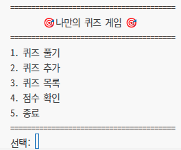
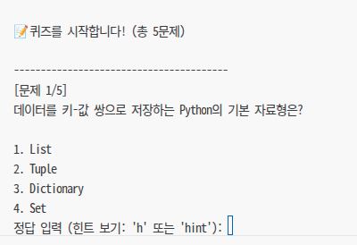
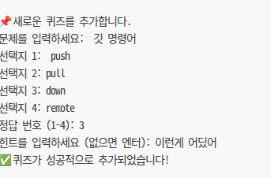
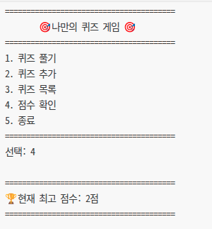

# 나만의 코딩 퀴즈 게임 🎯 (Mission E1-2)

## 📖 프로젝트 개요
이 프로젝트는 파이썬(Python) 기본 문법과 객체 지향 프로그래밍(클래스)을 활용하여 구현된 터미널 기반의 퀴즈 게임입니다. 
사용자는 제공된 퀴즈를 풀고, 나만의 새로운 퀴즈를 등록하며, 이전 기록을 저장 및 불러올 수 있습니다. 또한 예외 처리 방어 로직과 Git을 통한 버전 관리를 적용하여 더욱 견고하게 제작되었습니다.

## 🤔 퀴즈 주제 선정 이유
**주제: Python 및 IT 기본 상식**
프로그래밍을 처음 시작하며 배우는 파이썬의 역사, 자료형, 기본 명령어, 그리고 Git과 같은 IT 기초 지식들을 스스로 복습하고 정리하기 위해 이 주제를 선정했습니다. 문제를 풀며 지식을 다지는 효과를 기대합니다!

## 🚀 실행 방법
이 프로그램은 Python 3.10 이상의 환경에서 외부 라이브러리 없이 실행 가능합니다. 

```bash
# 디렉토리 이동
cd E1-2

# 프로그램 실행
python quiz.py
```

## ✨ 기능 목록
1. **퀴즈 풀기**: 저장된 퀴즈가 랜덤하게 출제됩니다. (힌트 확인 기능 및 점수 차감 로직 포함)
2. **퀴즈 추가**: 원하는 질문과 4개의 선택지, 정답 번호, 그리고 힌트를 추가할 수 있습니다. 입력된 정보는 퀴즈 세트에 즉시 반영됩니다.
3. **퀴즈 목록 조회**: 지금까지 등록된 퀴즈의 전체 문제 목록을 확인할 수 있습니다.
4. **점수 확인**: 역대 게임 플레이 중 얻은 최고 점수 기록을 확인합니다.
5. **예외 처리 기법**: 숫자가 아닌 문자 입력, 공백, 범위 밖 숫자, `Ctrl+C` 등을 완벽히 방어하여 비정상 종료를 막습니다.

## 📁 파일 구조
```text
codyssey/
├── E1-2/
│   └── quiz.py      # 게임 실행을 담당하는 메인 코드 (Quiz / QuizGame 클래스)
├── state.json       # 영구 저장을 위한 데이터베이스 파일
└── README.md        # 프로젝트 설명서 (현재 파일)
```

## ⚙️ 초기 설정 내역
```bash
$ git init
$ git config user.name "1st0Groom"
$ git config user.email "nadomolla08@naver.com"
$ git config init.defaultBranch main
$ git config --list

core.repositoryformatversion=0
core.filemode=true
core.bare=false
core.logallrefupdates=true
user.name=1st0Groom
user.email=nadomolla08@naver.com
init.defaultbranch=main
```

## 📂 데이터 파일 설명 (`state.json`)
게임 종료 후에도 추가된 퀴즈와 최고 점수가 유지되도록 데이터를 저장하는 핵심 파일입니다.

- **경로**: `/state.json` (프로젝트 루트)
- **역할**: 게임 진행 상황(최고 점수)과 커스텀 생성 퀴즈 목록을 영구 저장합니다.
- **스키마 구조**:
```json
{
    "quizzes": [
        {
            "question": "Python의 창시자는?",
            "choices": ["Guido", "Linus", "Bjarne", "James"],
            "answer": 1,
            "hint": "종신 자비로운 독재자"
        }
    ],
    "best_score": 3
}
```

## 🧐 클래스(Class)란 무엇인가요?
클래스는 객체 지향 프로그래밍(OOP)에서 데이터를 보관하고(속성), 데이터를 처리하는 방법(메서드)을 하나로 묶어놓은 "설계도" 또는 "틀"입니다.
- **객체(Object/Instance)**: 설계도(클래스)를 바탕으로 실제 메모리에 생성된 결과물입니다.
- 예를 들어, `붕어빵 틀`이 클래스라면, 그 틀에서 만들어진 팥 붕어빵, 슈크림 붕어빵은 각각의 `객체(인스턴스)`가 됩니다.
- 파이썬에서는 `class` 키워드를 사용하여 정의하며, `__init__` 메서드(생성자)를 통해 객체가 처음 만들어질 때 가져야 할 초기 상태를 설정할 수 있습니다.

## 🔍 `quiz.py` 코드 리뷰 (상세 분석)
이 섹션은 `quiz.py` 파일의 주요 구성 요소들을 블록 단위로 나누어 각 클래스, 메서드, 그리고 주요 로직이 어떻게 동작하는지 심층적으로 분석한 자료입니다.

### 1. 모듈 임포트 (Imports)
```python
import sys        # 프로그램 종료(sys.exit)를 위해 사용합니다.
import random     # 퀴즈 출제 시 문제의 순서를 무작위로 섞기(random.shuffle) 위해 사용합니다.
import json       # 파이썬 객체(딕셔너리, 리스트)를 JSON 문자열로 변환하여 저장하거나, 그 반대로 불러올 때 사용합니다.
import os         # 파일 시스템 경로 조합 및 존재 여부를 확인(os.path)하기 위해 사용합니다.
```
- **역할**: 프로그램 구동에 필요한 외부 라이브러리가 아닌 파이썬 내장 표준 모듈들만 가져오도록 구성하여 환경 세팅의 복잡성을 낮추었습니다.

### 2. `Quiz` 클래스: 개별 문제 데이터 모델 (데이터 캡슐화)
각각의 퀴즈 한 문제에 대한 '정보'와 관련 '기능'을 담당하는 설계도입니다.

```python
class Quiz:
    def __init__(self, question, choices, answer, hint=""):
        self.question = question   # 문제 내용 (예: "Python 창시자는?")
        self.choices = choices     # 1~4번 선택지 리스트 (예: ["Guido", "Linus", "James", "Bjarne"])
        self.answer = answer       # 정답인 선택지의 번호 (1~4의 정수)
        self.hint = hint           # 플레이어에게 제공할 힌트 (기본값은 빈 문자열)
```
- **생성자(`__init__`)**: `Quiz` 인스턴스(객체)가 만들어질 때 호출됩니다. 외부에서 넘겨받은 상태값들을 본인의 속성(attribute)으로 저장합니다.

```python
    def display(self, index=1, total=1):
        print(f"\n{'-'*40}")
        print(f"[문제 {index}/{total}]")
        print(self.question, "\n")
        # enumerate(self.choices, 1)을 사용해 인덱스를 1부터 시작하여 출력
        for i, choice in enumerate(self.choices, 1):
            print(f"{i}. {choice}")
```
- **문제 출력 (`display`)**: 터미널 환경에서 이 문제 하나를 어떻게 예쁘게 그려낼지 책임집니다. 전체 문제 수 대비 현재 몇 번째 문제인지 표기하여 UX를 개선했습니다.

```python
    def check_answer(self, user_input):
        try:
            return int(user_input) == self.answer
        except ValueError:
            return False
```
- **정답 판별 (`check_answer`)**: 사용자가 터미널에 입력한 글자(`user_input`, 문자열)를 정수형으로 전환한 뒤 정답 번호와 비교합니다. 문자를 입력해 `int()` 변환 시 에러가 발생하는 경우를 `try-except`로 우아하게 잡아내어 `False(오답)`로 처리하는 뛰어난 방어 로직입니다.

### 3. `QuizGame` 클래스: 메인 컨트롤러 및 시스템 (비즈니스 로직)
애플리케이션의 전역 상태 관리 및 사용자 입력에 따른 프로그램 흐름 통제를 담당합니다.

#### 3.1. 초기화 및 상태 로드
```python
class QuizGame:
    def __init__(self):
        self.quizzes = []    # Quiz 객체들을 담아둘 메인 데이터 리스트
        self.best_score = 0  # 최고 점수 저장용 변수
        # 스크립트 실행 위치(pwd)가 변경되더라도 항상 올바른 state.json을 가리키도록 절대 경로 계산
        self.state_file = os.path.abspath(os.path.join(os.path.dirname(__file__), "..", "state.json"))
        self.load_data()     # 객체 생성 직후 바로 파일로부터 데이터 로드
```
- **경로 무결성 보장**: `__file__`을 기반으로 부모 디렉토리(`..`)의 `state.json` 경로를 동적으로 알아냅니다. 이는 시스템 어디에서 `python quiz.py`를 실행해도 파일 경로 에러가 나지 않도록 하는 핵심 코드입니다.

#### 3.2. 영구 데이터 불러오기 및 기본값 초기화 (`load_data`)
```python
    def load_data(self):
        if os.path.exists(self.state_file): # 파일이 실제로 하드에 존재하는지 검사
            try:
                with open(self.state_file, "r", encoding="utf-8") as f:
                    data = json.load(f) # JSON 문자열을 파이썬 딕셔너리로 역직렬화
                    self.best_score = data.get("best_score", 0)
                    for q in data.get("quizzes", []):
                        # 읽어들인 딕셔너리 데이터를 다시 Quiz 클래스 객체로 변환하여 리스트에 추가
                        self.quizzes.append(Quiz(q["question"], q["choices"], q["answer"], q.get("hint", "")))
                return
            except Exception as e:
                print(f"⚠️ 데이터 파일 오류... (이하 생략)")
        
        # 파일이 없거나 손상되었을 경우 기본 제공 퀴즈들로 self.quizzes를 채움
        self.quizzes = [ Quiz("...", [...], 1, "..."), ... ]
        self.best_score = 0
        self.save_data() # 초기화된 데이터를 즉시 파일로 생성
```
- **초기 셋업**: DB 역할을 하는 JSON 파일 내부의 텍스트가 파이썬이 이해할 수 있는 `Quiz` 객체들의 리스트로 변환되는 역직렬화 과정입니다. 파일이 없거나 망가진 경우를 대비해 **Fallback(대체) 기본값**이 하드코딩 되어 있습니다.

#### 3.3. 영구 데이터 저장 로직 (`save_data`)
```python
    def save_data(self):
        data = {
            # List Comprehension 기법을 활용해 Quiz 인스턴스 배열을 순수 딕셔너리 배열로 직렬화
            "quizzes": [{"question": q.question, "choices": q.choices, "answer": q.answer, "hint": q.hint} for q in self.quizzes],
            "best_score": self.best_score
        }
        with open(self.state_file, "w", encoding="utf-8") as f:
            json.dump(data, f, ensure_ascii=False, indent=4) # indent로 보기 좋은(가독성) JSON 구성
```
- **데이터 직렬화**: 파이썬 사용자 정의 객체(`Quiz 인스턴스`)는 JSON 라이브러리가 바로 저장할 수 없습니다. 따라서 리스트 내포 문법을 통해 모든 속성들을 빼내어 다루기 쉬운 `dict` 타입들의 조합으로 묶어낸 후 파일에 기록합니다.

#### 3.4. 메인 루프 (앱 구동부)
```python
    def run(self):
        while True:
            self.display_menu() # 메뉴 출력
            choice = input("선택: ").strip()
            
            # 입력값 검증 (예: 그냥 엔터만 쳤을 때 방어)
            if not choice: continue
                
            # 라우팅
            if choice == '1': self.play_quiz()
            elif choice == '2': self.add_quiz()
            # 중략...
            elif choice == '5': sys.exit(0) # 프로그램 강제 종료
```
- **루프 및 제어 흐름**: 무한 루프(`while True`)를 돌면서 입력을 받고, 사용자의 선택에 따라 각 맞는 함수(메서드)로 제어권을 넘깁니다. 딕셔너리 매핑 대신 가장 직관적인 if-elif 분기를 채택하여 가독성을 높였습니다.

#### 3.5. 핵심 컨텐츠: 퀴즈 추가 및 풀기
```python
    def add_quiz(self):
        print("\n📌 새로운 퀴즈를 추가합니다.")
        # 1. input() 함수를 이용한 문제 내용 입력
        # 2. 4개의 선택지 반복 입력 (for 루프 활용)
        # 3. 정답 번호 입력 및 예외 검증 무한 루프 (while True) 
        # 4. 입력 성공 시 새로운 Quiz 객체를 인스턴스화 후 self.quizzes.append() 로 추가
        # 5. self.save_data() 호출하여 즉시 파일(DB)에 동기화 반영
```
- **문제 등록**: 사용자로부터 데이터를 직접 입력받을 때 빈 문자열이거나 숫자 범위가 틀리면 올바른 값이 들어올 때까지 무한 루프로 갇혀있게 설계되어 있어서 올바르고 완벽한 형태의 데이터만 시스템에 들어오도록 제어합니다.

```python
    def play_quiz(self):
        play_list = self.quizzes.copy() # 원본 데이터 보존을 위해 리스트의 얕은 복사본을 생성
        random.shuffle(play_list)       # 생성된 복사본 리스트를 무작위로 섞음 (랜덤 출제)
        
        score = 0
        for i, q in enumerate(play_list, 1):
            q.display(i, len(play_list))
            used_hint = False
            
            while True:
                user_input = input("정답 입력 (힌트 보기: 'h' 또는 'hint'): ").strip().lower()
                
                # ... (빈값, 힌트 요청 등의 방어 로직) ...
                
                # 정답 판단 로직 처리를 Quiz 객체(q)로 역할 위임(Delgation)
                if q.check_answer(user_input):
                    earned = 0.5 if used_hint else 1 # 조건부 연산식을 활용한 힌트 패널티 점수 적용
                    score += earned
                break # 한 문제 처리가 끝났으므로 다음 문제로 넘어감

        # 게임이 완전히 종료된 후 최고 점수 갱신 처리
        if score > self.best_score:
            self.best_score = score
            self.save_data()
```
- **객체 지향적 접근**: `play_quiz` 안에서는 전체 점수 계산과 게임의 흐름만 관리하고, 실제 문제를 보여주는 동작과 정답을 검사하는 동작은 `Quiz` 객체(q) 스스로가 담당하게 하는 모범적인 객체 지향 프로그래밍(OOP) 패턴이 아주 잘 녹아있습니다.

### 4. 프로그램 진입점 (Entry Point & Exception Handling)
```python
if __name__ == "__main__":
    try:
        game = QuizGame() # 앞서 만들어둔 거대한 설계도대로 실제 엔진 객체를 빵! 하고 만들어냅니다.
        game.run()        # 곧바로 엔진의 시동을 걸어줍니다 (메인 루프 돌입).
    # 플레이어의 의도치 않은 'Ctrl+C' 종료(KeyboardInterrupt)에 대한 최상단 방어
    except (KeyboardInterrupt, EOFError):
        print("\n⚠️ 비정상 종료를 감지했습니다. 프로그램을 안전하게 종료합니다.")
        sys.exit(0)
```
- **안전한 종료 보장**: 파이썬 스크립트가 실행될 때 최초로 진입하는 시작 구역입니다. 프로그램 실행 중 사용자가 강제로 실행을 중지키시키려 할 때 흉측하고 보기 힘든 Traceback 에러를 보여주는 대신, 정제된 메시지를 출력하고 프로세스를 안전하게 종료하도록 하여 사용자 경험(UX)을 대폭 향상시켰습니다.

## 📸 실행 화면 (스크린샷 제출용)
**1. 메인 메뉴**


**2. 퀴즈 플레이 화면**


**3. 퀴즈 추가 화면**


**4. 최고 점수 확인**


- [x] Clone 및 Pull 원격 실습 확인 완료

### Case 4: 도커 스냅샷 불변성(Immutability) 오해 및 바인드 마운트로 해결
- **문제 상황**: 서버 인프라는 정상이나, 호스트의 `src/index.html` 파일 내용을 수정해도 웹 브라우저 화면의 코드가 업데이트되지 않음.
- **원인 가설**: Dockerfile의 `COPY` 지시어로 구워진 이미지는 빌드 시점의 '정적 스냅샷'이므로, 실행 중인 컨테이너는 호스트의 파일 변경을 감지할 수 없는 구조(불변성)임을 인지함.
- **확인 및 해결**: 변경 시마다 다시 빌드하는 비효율을 제거하기 위해, `-v "$PWD/src:/usr/share/nginx/html"` 옵션을 추가한 바인드 마운트(Bind Mount) 방식으로 컨테이너를 재실행함. 호스트 소스 디렉토리와 컨테이너 내부를 직접 마운트하여 실시간으로 데이터가 동기화됨을 증명함.
